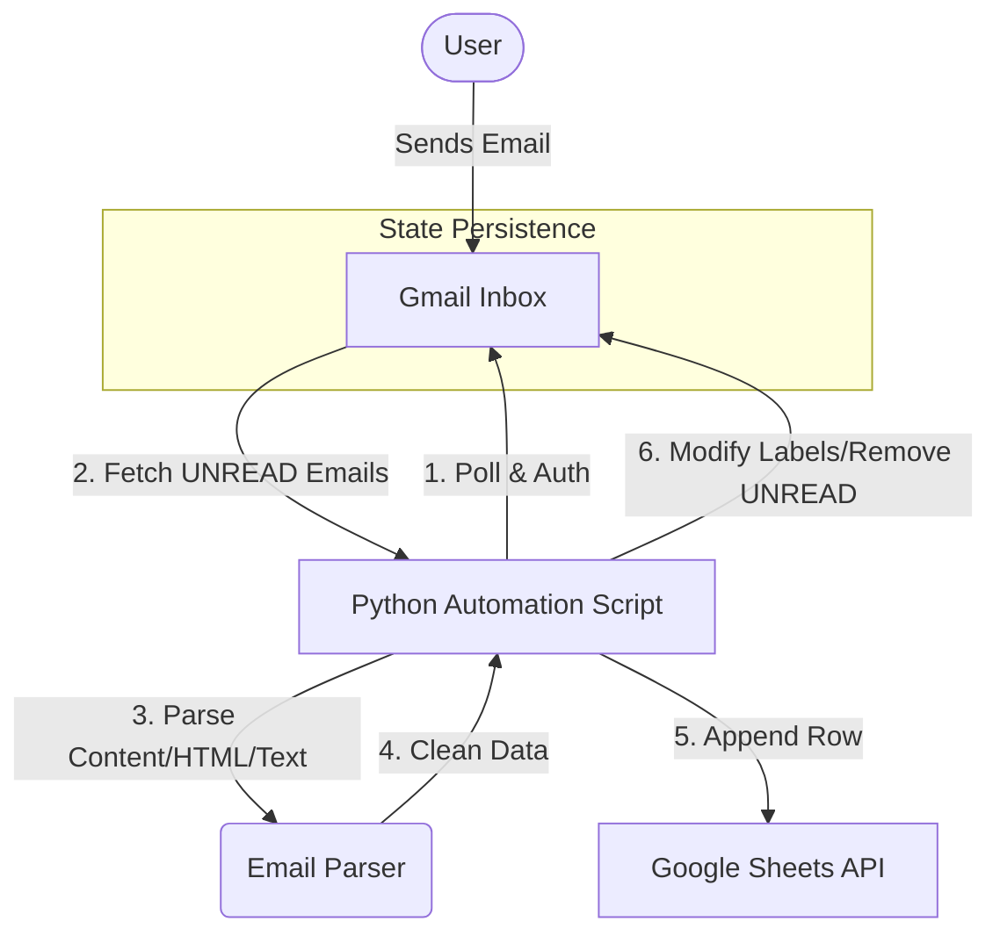

# Gmail to Google Sheets Automation

**Author:** ANURAG RAY  
**Project:** Internship Assignment
**Status:** Completed

---

## 📌 Project Overview
This Python automation system connects to a Gmail account, identifies specific unread emails, and logs their details (Sender, Subject, Date, Content, Attachments(New)) into a Google Sheet. It utilizes the **Gmail API** and **Google Sheets API** with secure OAuth 2.0 authentication.

**Objective:** To create a "State-Aware" system that processes incoming emails exactly once, preventing duplicates even if the script is restarted.

---

## 🏗️ High-Level Architecture Diagram


# ⚙️ Setup Instructions

1. Prerequisites
Python 3.8+

Google Cloud Project with Gmail API and Google Sheets API enabled.

credentials.json (OAuth Client ID file).
(As instructed use dummy email for testing)

2. Installation
Clone the repository:
```
git clone https://github.com/anurag2580/Gmail-To-GoogleSheets-Automation.git
cd gmail-to-sheets
 ''' I have create venv(virtual environment file iside my project folder which consider according to my experience try ) to install module in locally in project folder '''

# Install Dependencies:
pip install -r requirements.txt
```
# Credentials Setup:

Place your credentials.json file inside the credentials/ folder.
(Note: This file is excluded from github repo)

# Instruction --- how to Get credentials.json file 
 1.First go to google cloud console
 2.Create project with name
 3.In sidebar Search for API&sevice
 4.Choose the Services you needed
 5.Get the file Rename it as Credentials File

# Configuration:

Open src/config.py.
Update SPREADSHEET_ID with your target Google Sheet ID.

#Execution 

Run the main script:
``` python src/main.py ```
or
```    python -m src.main ```

On the first run, a browser window will open for OAuth authentication.

Grant permissions to allow the script to read emails and write to sheets.

### 🧠 Design Decisions & Explanations
# 1. OAuth Flow Used 

I utilized the InstalledAppFlow from the google_auth_oauthlib library.

Reasoning: This is the standard secure method for desktop/CLI applications. It ensures the user grants explicit permission via a browser interface without hardcoding passwords.

Token Management: Access and refresh tokens are stored locally in token.json. This allows the script to run subsequently without re-prompting the user for login.

# 2. State Persistence & Duplicate Prevention 

How state is stored: The system relies on Gmail Labels as the "State Store" rather than an external database.

The Logic:

Fetch: The script specifically queries for label:INBOX AND is:unread.

Process: It extracts data and pushes it to Google Sheets.

Update State: Immediately after a successful write to Sheets, the script calls the Gmail API to remove the UNREAD label (effectively marking it as Read).


Why this approach?  This makes the operation idempotent. If the script crashes after processing 3 out of 10 emails, the 3 processed ones are already "Read". When the script restarts, it will only see the remaining 7 "Unread" emails. This guarantees zero duplicates without complex database logic.

### ⚠️ Challenges & Solutions 

Challenge: Handling Multipart Email Formats Emails are rarely just text; they are often complex multipart/alternative structures containing both HTML and Plain Text. Initially, the script would pull raw HTML tags (like <div><br>) into the Google Sheet, making it unreadable.

Solution: I implemented a prioritized parsing logic in src/email_parser.py:

The script first searches for a text/plain MIME type.

If not found, it falls back to text/html.

I integrated BeautifulSoup to strip all HTML tags from the content, ensuring only clean, human-readable text is stored.

### 📉 Limitations 

Attachment Handling: The system currently lists attachment filenames but does not download or store the actual files due to Google Sheets cell limits.

API Quotas: The application is subject to Google's daily API rate limits (e.g., 25,000 queries/day).

Scope: It currently only scans the primary Inbox, ignoring Spam or nested folders unless configured otherwise.

### 📸 Proof of Execution
Also Screenshots located in proof/ directory
 1. inbox_unread.png
 2. terminal_output.png
 3. sheet_populated.png
 4. Authpage1.png
 5. Authpage2.png
## Project Overview
youtube link : https://youtu.be/tUR3Vf1uOFQ
 
  
